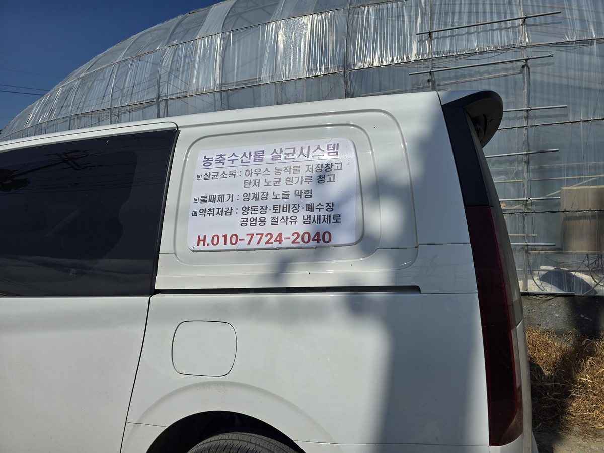

# (주)아륭기업 플라즈마 살균 시스템 공식 안내 웹사이트

> **50년 전통 대한민국 유체공학 선도기업 (주)아륭기업**  
> **플라즈마사업팀 총본부장 이종선 | 직통 상담: 010-7724-2040**  
> 🌐 **공식 실시간 웹사이트:** [https://naju-three.vercel.app](https://naju-three.vercel.app)



---

## 📌 프로젝트 소개
농·축·수산업 및 산업 현장의 고질적인 병해충, 배관 물때(바이오필름), 악취, 유기물 부패 문제를 친환경 저온 플라즈마 활성수(PAW) 기술로 해결하는 **아륭기업 플라즈마 살균 시스템(APG Series)** 홍보 및 상담 웹사이트입니다.

스마트폰 환경에 최적화된 **모바일 퍼스트(Mobile-First) 반응형 싱글페이지 웹사이트**로, 대표 상품 소개와 현장 책임자(이종선 총괄본부장)의 프로필 및 직통 상담 채널(전화/문자/간편 신청)을 직관적으로 제공합니다.

---

## 🌟 핵심 특징

1. **차량 래핑 디자인 모티브의 메인 비주얼**
   - 농·축·수산물 3대 혁신: [살균소독 99.9%] [배관 물때 완벽제거] [악취저감 75%]
   - 현장 방문 및 실증 중심의 신뢰도 높은 브랜딩

2. **사람(책임자) 중심의 신뢰 구축**
   - **아륭기업 플라즈마사업팀 총본부장 이종선**의 현장 설치/점검 실사진 배치
   - 현장 방문 무료 진단 및 맞춤형 배관 설계 약속
   - 원클릭 직통 전화(`010-7724-2040`) 및 사전 작성 문자 상담 연동

3. **상품 소개 및 특허 기술 안내 (ARYUNG APG-001 / APG-002 Aurora+)**
   - 60W 초저전력 구동 (연중 가동 시에도 전기요금 부담 제로)
   - 15 LPM 대용량 플라즈마 가스 토출
   - OH 라디칼(2.80V), O3(2.07V), H2O2(1.77V) 복합 산화력으로 잔류 화학물질 없이 99.9% 멸균

4. **산업 분야별 맞춤 적용 사례**
   - **농업 / 시설하우스**: 탄저병·노균병·흰가루병 99.9% 방제, 농산물 저장기간 2~3배 연장
   - **축산 / 양계·양돈**: 급수배관/니플 물때(바이오필름) 완전 제거, 돈사 악취 75% 저감, 폐사율 급감
   - **수산 / 양식장·활어수조**: 어패류 폐사율 78% 감소, 물갈이 주기 3배 연장, 백점병 살균
   - **공업 / 공작기계**: 절삭유 부패 악취 100% 제거, 절삭유 교체비용 75% 절감

5. **검증된 경제성 (ROI) 및 공인 인증**
   - 도입 후 수개월(4~7.8개월) 내 투자비 전액 회수 데이터 제시
   - CE, TÜV 인증 및 특허, 국가 공인 시험기관 살균 성적서 보유

6. **모바일 최적화 하단 고정 상담바 (Sticky Bottom Bar)**
   - 스크롤과 상관없이 상시 직통 통화 및 문자 상담 가능

---

## 📁 디렉토리 구조

```plaintext
naju/
├── index.html            # 메인 웹페이지 (시맨틱 HTML5, SEO & OpenGraph 최적화)
├── css/
│   └── style.css         # 모바일 퍼스트 반응형 스타일시트
├── js/
│   └── main.js           # FAQ 아코디언, 간편 문의 폼(SMS 자동완성), 이미지 라이트박스
├── images/               # 웹 최적화 고화질 이미지 (Web-optimized JPEG)
│   ├── hero-van.jpg
│   ├── leader-field.jpg
│   ├── product-apg001.jpg
│   ├── crop-greenhouse.jpg
│   ├── crop-healthy.jpg
│   └── ...
├── vercel.json           # Vercel 배포 설정 (Clean URLs & 정적 자산 캐싱)
├── .vercelignore         # Vercel 배포 최적화 제외 목록
├── .gitignore            # Git 관리 제외 파일 목록
└── README.md             # 프로젝트 안내서
```

---

## 🚀 배포 가이드 (Vercel)

본 프로젝트는 순수 HTML5/CSS3/Vanilla JS로 빌드 과정 없이 정적 웹 호스팅(Vercel, GitHub Pages, Netlify 등)에 즉시 배포할 수 있습니다.

### Vercel 배포 방법:
1. [Vercel](https://vercel.com) 로그인
2. **Add New...** -> **Project** 클릭
3. `plasmalife/naju` GitHub 리포지토리 Import
4. Framework Preset은 **Other** (Static) 선택
5. **Deploy** 버튼 클릭 -> 즉시 글로벌 CDN으로 실시간 배포 완료!

---

## 📞 고객 상담 및 제품 문의
- **담당자**: (주)아륭기업 플라즈마사업팀 총본부장 이종선
- **전화번호**: 010-7724-2040
- **상담분야**: 농가/축사/양식장/가공공장 맞춤형 플라즈마 살균 시스템 무료 현장 실사 및 견적
